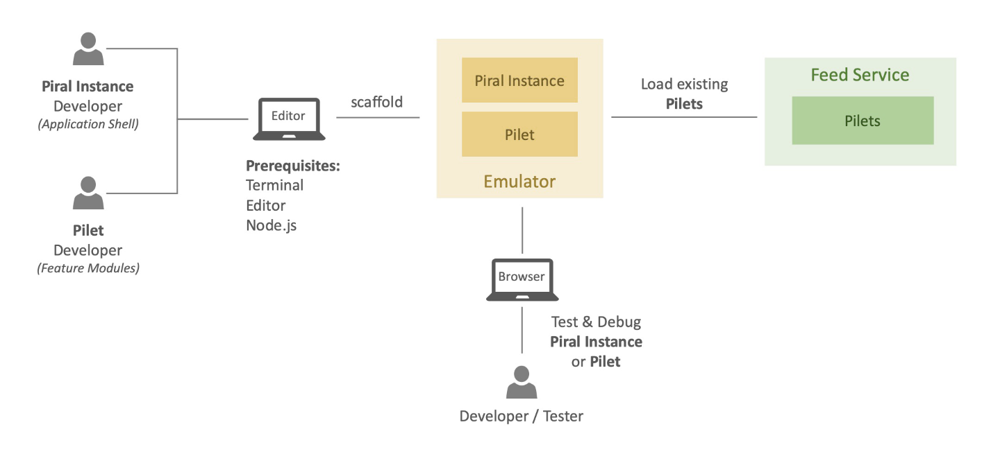
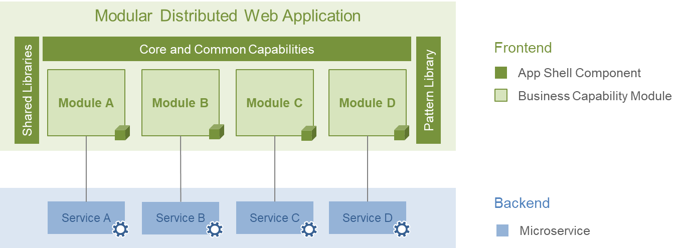

# Micro-Frontend with Piral Framework

## What is a microfrontend?
A micro-frontend is an architectural style where a frontend app is composed of multiple smaller frontend apps or components. Each component is developed, deployed and maintained by different teams independently.

The key ideas behind microfrontends are:

- Break down a monolithic frontend into smaller pieces
- Allow teams to work in parallel on different features
- Each team owns the full lifecycle of their microfrontend component
- Components are integrated into a single user interface at runtime

This approach aims to allow large organizations to scale frontend development by giving teams autonomy and avoiding monolithic codebases that are difficult to maintain and evolve.

## What is Piral?
Piral is an open source framework for building modular web applications using micro-frontends. It allows you to combine multiple independent applications or components into a single user interface. The key features of Piral include:
- Composing applications from different sources
- Isolating team code and deployment
- Sharing dependencies and state
- Routing between components
- Updating components independently

Piral makes it easier to adopt a micro-frontend architecture, where different teams can develop and deploy parts of a web app separately, while still providing a seamless user experience.

## Setting up the Piral Tooling

### Install the Piral CLI
    npm i piral-cli -g

### Check version of the Piral CLI
    piral --version

## Create an Application Shell (Piral Instance)

### Setup a new Piral (App Shell) Instance
    piral new --target app-shell

## Run the Application Shell
    piral debug

## Create Package for the Application Shell
    piral build

>This will trigger the build of a Piral instance. By default, this command will create two folders within the `dist` folder: `emulator` and `release`. The latter contains the files for publishing the app shell to some host later on. The former contains an emulator package.

## Create Pilet using the Piral CLI
    pilet new ./app-shell/dist/emulator/app-shell-1.0.0.tgz --target my-pilet

With the `pilet new` command, a new pilet with pre-defined content is created. The first parameter `./app-shell/dist/emulator/app-shell-1.0.0.tgz` specifies the application shell, which the pilet will be built for. Make sure that you adjust the path to the Piral instance located in your local directory structure.

## Start the Pilet
    pilet debug

## Build pilet
    pilet build

## Pack pilet
    pilet pack

## Do all of the three above pilet commands (build, pack, publish) just use `--fresh`
    pilet publish --fresh --url sample

## Publish pilet to piral cloud
    pilet publish --fresh  --url https://feed.piral.cloud/api/v1/pilet/mx-demo --api-key <KEY>

## Publish pilet to local feed instance
    pilet publish --fresh  --url http://localhost:8181/api/v1/pilet --api-key df133a512569cbc85f69788d1b7ff5a909f6bcfe1c9a2794283a2fc35175882c

---
## Build a docker image
    docker build -t my-piral-app .

## Run the image
    docker run -p 3000:1234 my-piral-app

## Run using the docker compose file
    docker-compose up -d --build

## Stop running container
    docker-compose down

## Links
- [Piral: Getting Started](https://docs.piral.io/guidelines/tutorials/02-getting-started)
- [Publishing Pilets](https://docs.piral.io/guidelines/tutorials/03-publishing-pilets)
- [Error Codes](https://docs.piral.io/code/0000)